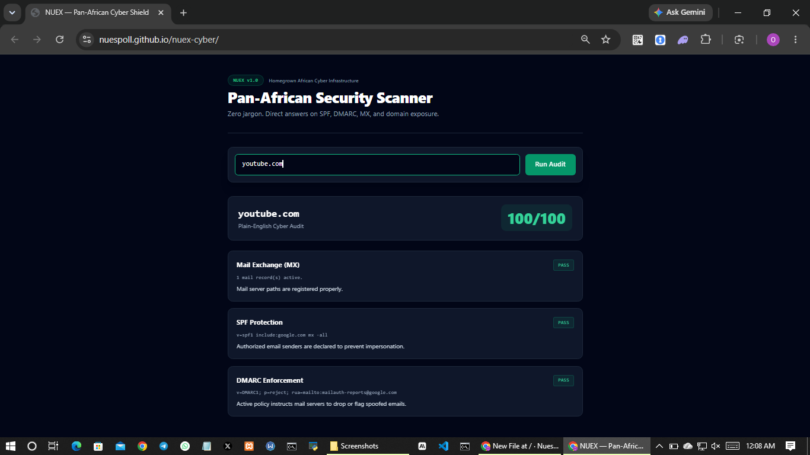

# NUEX — Pan-African Cyber Defence Platform 🌍
> **Africa loses billions yearly to cyber threats the continent has no infrastructure to detect, let alone stop.**  
> NUEX is a homegrown, browser-native security platform engineered for zero jargon and high resilience under low-bandwidth, unreliable ISP conditions.

---

## 🚀 Live Interactive Scanner
👉 **Try NUEX Scanner Live:** `https://nuespoll.github.io/nuex-cyber/`
👉 

---

## ⚡ Key Features
- **DNS-over-HTTPS (DoH) Engine:** Performs DNS, SPF, DMARC, and MX audits directly in the browser with zero backend dependency.
- **Plain-English Threat Scoring:** Converts raw DNS responses into immediate risk assessments (CRITICAL / WARNING / SECURE).
- **Zero-Infrastructure Footprint:** Built to run efficiently on any connection without requiring heavyweight foreign security agents.

---

## 🛡️ Core Security Audits
| Module | Technical Audit | Plain-English Answer |
| :--- | :--- | :--- |
| **MX Check** | `DNS RESOLVE MX` | Prevents email bouncebacks and missing mail configuration. |
| **SPF Engine** | `TXT v=spf1` | Identifies unauthorized servers spoofing your company emails. |
| **DMARC Shield**| `TXT _dmarc` | Enforces Gmail/Outlook policies to reject business email compromise (BEC). |

---

## 🛠️ Architecture
NUEX runs entirely client-side — no backend server, no infrastructure cost, no single point of failure.

- **Frontend:** Vanilla HTML, CSS, and JavaScript — no framework overhead, fast load even on weak connections.
- **DNS Resolution:** Cloudflare DNS-over-HTTPS (`1.1.1.1/dns-query`) for secure, encrypted DNS lookups directly from the browser.
- **Scoring Engine:** Custom JavaScript logic parses raw DNS/TXT records and converts them into a plain-English risk score (0–100), flagged CRITICAL / WARNING / SECURE.
- **Why this matters:** Most African SMEs can't afford enterprise security tooling or a dedicated backend. NUEX proves a serious security audit can run for free, in any browser, with no install.

---

## 🗺️ Roadmap
- [ ] Expand audits to SSL/TLS certificate health and expiry
- [ ] Add exportable PDF audit reports for client-facing use
- [ ] Build a CLI companion for scheduled/automated scans
- [ ] Integrate threat intelligence enrichment (AbuseIPDB)

---

## 👤 Built By
**Oluwaseun "Rudy" Olugbemi**  
Cybersecurity Student, LAUTECH (Ladoke Akintola University of Technology)  
Building NUEX and [SNPRX](https://github.com/NuesPoll) — pan-African cyber defence and blockchain security infrastructure.

📧 oluwa1295@gmail.com | 📱 07958958875
